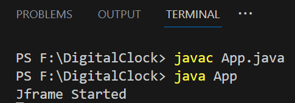
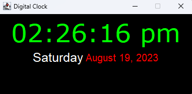

# Digital-Clock
I've created a Java-based digital clock that displays real-time hours and minutes in a user-friendly digital format. The clock utilizes Java's time-handling functionalities, providing an accurate and visually clear representation of the current time. 

## Getting Started

### Prerequisites

- Java Development Kit (JDK) installed on your system.

### Running the Application

1. Clone the repository to your local machine.
   ```bash
   git clone https://github.com/your-username/digital-clock.git
2. Navigate to the project directory.
   ```bash
   cd digital-clock
3. Compile and run the application.
   ```bash
   javac App.java
   java App


## Screenshots
 <br>
Output <br>


## Contributing

Contributions are welcome! Please open an issue or submit a pull request with any improvements.

## License

This project is licensed under the MIT License - see the LICENSE file for details.

